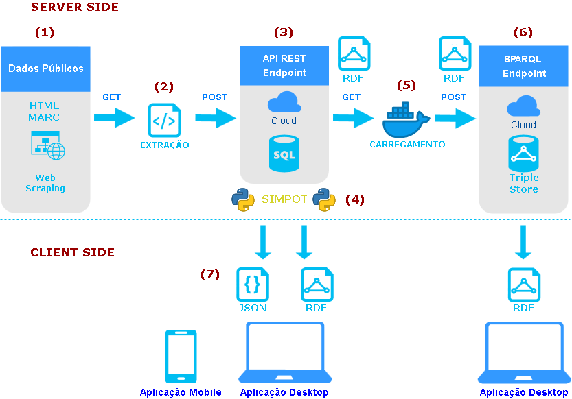

# INOVA CAMPUS - Universidade Federal do Maranhão

## 1. LODUFMA - Open Linked Data UFMA

### 1.1 Motivação
Desde a criação da lei de acesso aos dados de instituições públicas, prevista pela Constituição de 1989 e corroborado pela **Lei de Acesso a Informação** (Lei nº 12.527/11). Muitas instituições têm investido esforços nas diretrizes de abertura de seus dados, promovendo a transparência e o convite à comunidade na participação no desenvolvimento de novas soluções a partir de toda os dados compartilhados. 
Iniciativas como a **UFMA Open Linked Data** buscam a sua parcela de contribuição no desenvolvimento de novas soluções para o melhor aproveitamento de todos os dados gerados pela universidade.

### 1.2 Arquitetura

A imagem abaixo ilustra, de maneira geral, toda a estrutura da aplicação. É certo que existem algumas peculiaridades intrísecas à implementação de cada componente, no entanto não iremos abordá-las neste overview.



#### 1.2.1 (1) Scrapper
Nesta etapa da aplicação os dados ainda se encontram nos portais públicos, isto é, os dados nesta etapa da aplicação ainda não se encontram nas diretrizes de [Dados Abertos](http://dados.gov.br/pagina/dados-abertos).
O [Web Scraping](https://medium.com/data-hackers/como-fazer-web-scraping-em-python-23c9d465a37f) é um conjunto de técnicas que reúnem estratégias para a recuperação de dados  públicos em páginas web. Nesta fase da aplicação estamos extraindo todos os dados públicos de modo a selecionarmos apenas as informações necessárias, ignorando as demais.   
* **Code Base:** Python
* **Repositório:** [Link](https://github.com/inovacampus/ufma_scrapper)

#### 1.2.2 (2) Extração e Live API
Uma vez configurada a extração dos dados necessários podemos configurar roteamentos (endereços) convenientemente. 
Estes endereços nos permitem acionar, automaticamente, os scrappers de modo que possam nos retornar os dados pertinentes aquele endereço. 
Esta prática diz respeito ao padrão [REST](https://blog.caelum.com.br/rest-principios-e-boas-praticas/) ao qual permite a intercomunicação entre aplicações web.
A especificidade desta camada, é a de que os dados são extraídos em tempo real dos portais públicos, por isso o nome **Live API**. 
* **Code Base:** Python
* **Repositório:** [Link](https://github.com/inovacampus/ufma-live-api)

#### 1.2.3 (3) Database API
Esta camada segue o mesmo princípio da anterior, no entanto, ela é antecedida de de um provisionamento responsável pela extração de todos os dados disponíveis no portal público.
Estes dados são mapeamos e persistidos em um banco de dados, o que permite consultas mais refinadas e o consumo massivo dos dados disponíveis.
* **Code Base:** Python
* **Repositório:** [Link](https://github.com/inovacampus/ufma-api)

#### 1.2.4 (4) Simple Object Triple - SIMPOT
Como podemos observar no esquema a SIMPOT esta junto a camada (3), isto diz respeito a posição que ela assume na aplicação.
A SIMPOT é um módulo python desenvolvido para o mapeamento de dados RDF, isto é, inspirado no [SQLAlchemy](https://www.sqlalchemy.org/) ao qual faz o mapeamento objeto-relacional dos dados, a SIMPOT permite de maneira fácil e legível a criação de dados RDF.
Veja o exemplo abaixo:
```python
import simpot

from rdflib import Namespace, Literal, URIRef,RDF
from simpot import RdfsClass, BNamespace, graph
from rdflib.namespace import DC, FOAF


# exemplo do rdflib
class Person:
    nick = FOAF.nick
    name = FOAF.name
    email = FOAF.mbox

    @RdfsClass(FOAF.Person, None) # blank node
    @BNamespace("dc", DC)
    @BNamespace("foaf", FOAF)
    def __init__ (self, name, nick, email):
        self.nick = Literal(nick, lang="foo")
        self.name = Literal (name)
        self.email = URIRef(email) 

p = Person ("Donna Fales","donna", "mailto:donna@example.org")
print (graph(p).serialize())
```
* **Code Base:** Python
* **PyPi:** [Simpot](https://pypi.org/project/simpot/)
* **Repositório:** [Link](https://github.com/inovacampus/simpot)

#### 1.2.5 (5) e (6)  Carga e Execução da Aplicação
Esta camada é responsável pelo levantamento da aplicação que executará o [Apache Jena](https://jena.apache.org/), responsável pelo aplicação de Dados Conectados.
Uma arquivo [Docker](https://www.docker.com/) trará as instruções responsáveis por todo o ciclo de vida da aplicação passando pelo download dos dados RDF gerados anteriormente, pela execução do ambiente da aplicação de Dados Conectados e o carregamento de todos estes dados. 
* **Code Base:** Docker
* **Repositório:** [Link](https://github.com/inovacampus/linked-open-data-ufma)

#### 1.2.6 (7) Client Side
Aqui as aplicações já estão disponíveis para o usuário.
Estas estão online e disponíveis através dos links:
* [Dados Abertos UFMA](https://dados-ufma.herokuapp.com/)
* [Dados Conectados UFMA](https://linked-ufma.herokuapp.com/)

## 1.3 Considerações Finais

As ferramentas stão hospedadas sob licença gratuita no [Heroku](https://www.heroku.com/), o qual ocasionalmente possam passar por lentidões de resposta e carregamento.
Tais ferramentas referem-se a portais não oficiais da Universidade Federal do Maranhão.


